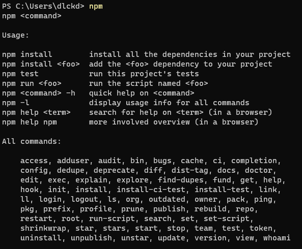
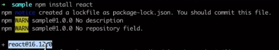
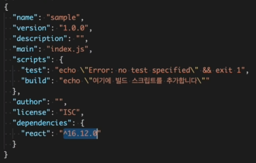

# NPM
## 01. 프로젝트 생성
### Node.js 설치결과물
1. Node.js REPL(Read-Eval-Print Loop)  
    - REPL(Read-Eval-Print Loop): 사용자의 인풋을 읽고(Read), 처리하고(Evaluate), 출력하는(Print) 환경. Node의 REPL은 터미널에서 CLI로 제공된다.  
    - Node.js REPL은 node설치시 자동을 설치되며, 터미널에서 JS 구문을 실행시킬 수 있다.  

2. NPM (Node Package Manager)  
    - `npm init`: npm으로 의존성을 관리할 수 있는 프로젝트를 생성
    - -> package.json 파일이 생성됨.
    - npm 명령어 목록 (`init` 도 npm 명령어 중 하나)
    
        - 커스텀 명령어를 추가하고 싶다면, package.json의 scripts에 `"_cmd": "_behavior"` 형식으로 입력하면 됨
        - 실행은 `npm run _cmd`

## 02. 외부 패키지를 관리하는 방법
### 외부 패키지를 사용하는 방법
1. CDN 사용
    - CDN (Content Delivery Network): 라이브러리 등 소스를 저장하는 컨텐츠 서버를 의미.
    - 소스가 브라우저에서 렌더링될 때마다, 코드를 가져옴. **필수 라이브러리를 가져오지 못하는 등, 장애 확률이 높음**
    - So, 필요한 소스를 미리 다운로드 받아 배포하면 너무 좋음
2. 내가 직접 다운로드
    - CDN에서 그때그때그땐 난 몰랐엇어 가져오는 것 보단, 소스코드를 우리 프로젝트에 미리 다운로드를 받아서 배포
    - 라이브러리 버전 호환성(Compatibility) 확인 과정에서 *human error*가 나기 쉬움. 즉, 사람을 믿을 수가 없음;
3. NPM이 대신 다운로드
    - 소스코드를 다운로드 받는 것은 똑같음
    - 라이브러리 버전 호환성을 자동으로 체크해줌
    - `npm install _library` 명령어를 사용해서 설치할 수 있음
        - `install` 명령어 사용시 **package.json 의 dependencies 프로퍼티에 등록됨**.
        - 또, 소스코드도 다운로드 받아옴
        -  
        - dev-dependencies, version management 등 여러 기능이 있음
### NPM의 패키지 버전 관리법

이미지에서 `^16.12.0` 은 어디서 배워먹은 버전 표기법일까?  
1. "16.12.0"은 "유의적 버전 표기법"이다.
    - 각 라이브러리의 버전 정보를 '엄격하게' 관리하면 일어나는 문제
        - '엄격하게 관리' 라는 말은 말 그대로 '고정된' 버전 정보를 기록해놓는 것
        - 문서에 특정 버전만 기록되어 있다면, 한 라이브러리를 수정하면 다른 연관된 라이브러리의 버전을 전부 바꿔야 될 수도 있다 (옛날엔 이렇게 했다고 한다)
        - 결국 또 다시 *human error* 직면
    - **유의적 버전(Semantic Version)** 이란
        - 너무 엄격하게/느슨하게 버전을 관리하지 않게 하기위한 **규칙**
        - NPM은 유의적 버전을 따르는 전제 하에 패키지 버전을 관리해준다
        - 이 [링크](https://semver.org/lang/ko/)에 접속하면, 여러나라 언어로 유의적 버전을 정의한 문서를 확인할 수 있다.
    - `^16.12.0` 의 `16.12.0` 은 이 유의적 버전 표기법을 따른 것이라 할 수 있겠다
    - 그럼 `^`는 뭘까?
2. "^"은 "버전의 범위 표기법" 이다.
    - `16.12.0` 은 딱 이 버전이다. 더도말고 덜도말고.
    - `>`, `>=`, `<`, `<=` 를 `16.12.0`앞에 붙이면, 16.12.0보다 크거나 작은 버전을 통칭하는 의미가 된다
    - `~`는 '틸드'라고 읽는다
        - 마이너 버전이 명시되어 있으면 패치버전을 변경한다
            - ex. `~16.12.0` = `16.12.0`이상 `16.13.0`미만
        - 마이너 버전이 명시되어 있지 않으면, 마이너 버전을 갱신한다
            - ex.  `~0` = `0.0.0`이상 `1.0.0`미만
        - 사실 잘 이해 안감
    - `^`은 '캐럿'이라고 읽는다
        - 정식 버전에서 마이너와 패치버전을 변경한다
            - ex. `^16.12.0` = `16.12.0`이상 `17.0.0`미만
        - 정식버전 미만인 0.X 버전에선 패치만 갱신한다.
            - ex.  `^0` = `0.0.0`이상 `0.1.0`미만
    - 옛날엔 `~`, 요즘엔 `^`을 많이 사용한다.
        - 정식 릴리즈 전엔 패키지 버전이 하위호환성을 지키지 않는 경우가 않고 업데이트되는 경우가 빈번하다. 0.2가 되면서 0.1에서 사용했던 기능을 못쓰게 되는것이다.
    - 이때, `^`를 사용해서 패치버전만 올리게 되면 정식릴리즈 되지 않은 라이브러리도 호환성 유지하며 패키지를 관리할 수 있다.