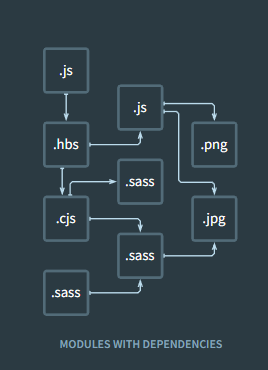
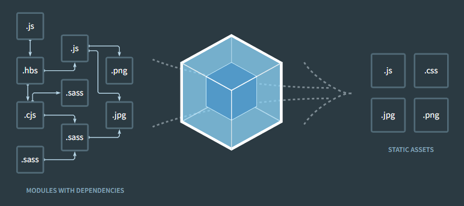
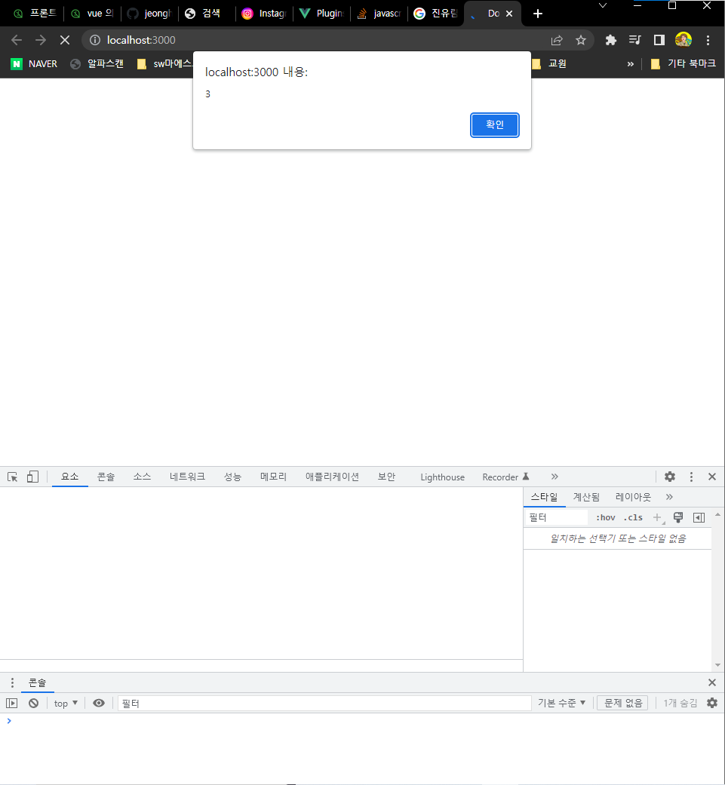
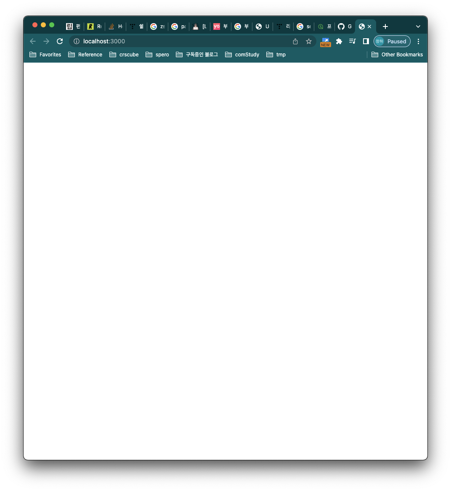
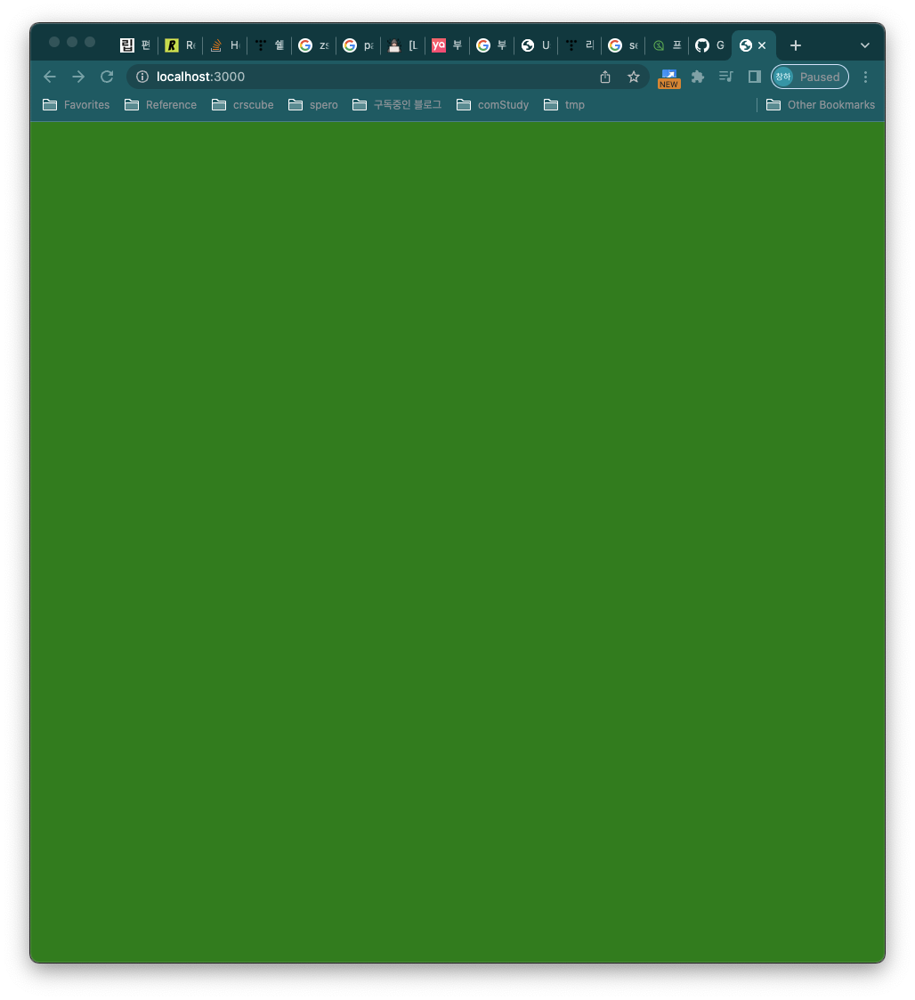
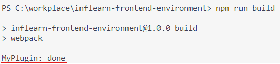

# Webpack
## 00. 팁
vscode에는 현재 폴더를 임시 서버로 만들어서 정적호스팅을 하고, 변경사항을 바로 렌더링 할 수 있게 해주는 live-server 플러그인이 있다.  

그런데, vscode live-server는 webpack과 같은 번들러를 통한 번들링 과정을 수행할 수 없으므로, nodejs 용 live-server가 필요하다 ([참고](https://www.quora.com/Why-not-use-the-VS-Code-live-server-extension-instead-of-installing-Node-js-and-then-installing-a-http-server-package-through-NPM)).  
이 강의에선 `lite-server`라는 Node 패키지를 사용한다.  
`npm install lite-server` 명령어로 설치할 수 있으며, 어차피 개발할 때 사용할거니 전역으로 설치해도 된다.

npx 명령어를 통해 다음과 같이 실행한다.  
`npx lite-server`  
명령어를 입력하면 현재 디렉토리를 경량 Nodejs 웹 서버로 만들어주고 실행시킨다.
## 01. webpack이 필요한 이유와 기본 동작
### webpack 등장 이전의 모듈
1. webpack 등장 이전 모듈 운용 방식의 원리
    - `sum` 메서드 정의 후, 이를 직접 사용하는 방식 (파일만 분리) 
        - math.js의 `sum` 메서드를 app에서 불러와서, index.html에 로드해보자
        ```
        // math.js
        function sum(a, b) {
            return a+b
        }
        // app.js
        console.log(sum(1,2));
        // index.html
        ...
        <script src="./src/math.js"></script>
        <script src="./src/app.js"></script>
        ...
        ```
        - index.html에 math,app을 모두 불러와서 사용해야 하는 이 방식은, **전역 스코프의 오염** 이라는 문제 야기한다.
        - 즉, index.html에 불러온 다른 js파일에서 math.js의 `sum`메서드를 사용할 수 있게 된다.
    - IIFE 방식의 운영
        - Self-Excution Anonymous Function 이라는 디자인 패턴의 일종
        - 즉시실행함수(Immediately Invoked Function Expression) 문법을 사용하는 방식
            ```javascript
            (function() {
                // statement
            })();
            ```
        - 위의 math/app 파일을 다음과 같이 변경함
            ```javascript
            // math.js
            var math = math || {};
            (function () {
                function sum(a, b) {
                    return a + b;
                }

                math.sum = sum;
            })
            // app.js
            console.log(math.sum(1,2));
            ```
            - 익명함수 내에 메서드를 정의함으로써, 외부에서 `sum`에 직접 접근할 수 없음. 대신 `math`객체를 통해 접근해야 함 (`math.sum()`)
            - 전역스코프에 메서드/변수를 추가하지 않으니, 스코프 오염을 야기하지 않음
2. Webpack 등장 이전, 모듈 명세
    - CommonJS
        - 모든 JS에서 사용가능한 명세.. 를 목표로 함
        - `exports` 키워드로 모듈을 만들고, `require()`함수로 모듈을 불러들이는 방식
        - 대표적으로 **Node.js**에서 CommonJS 명세를 사용한다.
            ```javascript
            // math.js
            exports function sum(a,b) { return a+b; }
            // app.js
            const sum = require('./math.js')
            sum(1,2);
            ```
    - AMD
        - 비동기 모듈 명세 (Asynchronous Module Definition)로, 비동기 로딩 환경에서 모듈을 사용하는것을 목표로 함 (비동기 로딩 환경 == 외부에서 JS코드를 로딩해야하는 환경)
        - 주로 **브라우져**환경에서 사용함
    - UMD
        - Universial Module Definition
        - CommonJS + AMD 모두 포함하는 명세
    - ES2015 **표준** 모듈 시스템
        - `export`, `import` 를 사용하는 방식
            ```javascript
            // math.js
            export function sum(a,b) { return a+b; }
            // app.js
            import * as math from './math.js';
            math.sum(1,2);
            ```
3. 브라우져의 모듈 지원
    - ES2015 표준 모듈 시스템을 지원하지 않는 IE같은 브라우져도 있음
    - 크롬에서도 `<script type="text/javascript" src="./src/app.js">`로는 사용 불가.
        - `type`을 `module`로 해줘야 함 (`<script type="module" src="./src/app.js">`)
    - 되든 안되든, 아무튼 **모듈을 사용하는 방식이 브라우져 마다 다름**
### Webpack의 등장
- 우린 **브라우져마다 다르게 코드를 작성하고 싶지 않다**. 하지만, 그렇게 하지 않으려면 모듈을 사용하면 안된다. 하나의 큰 js파일만 작성하면 굳이 모듈 시스템을 사용하지 안아도 된다!
- 미친소리다. 개발자들은 유지 보수할 수 없는 거대한 스파게티 코드를 만들고 싶지 않다.
- 그렇다면 **먼저 모듈로 개발한 뒤, 모듈간 의존성을 잘 파악하여 하나의 js파일로 합치면 되지 않을까?** 그렇다. 이게 webpack의 역할이다. 드디어 **webpack이 필요한 시점이다.**
## 02. 엔트리/아웃풋
### 번들(Bundle)  

- 모듈을 사용하게 되면 위 이미지 처럼 여러 파일들이 의존성을 가진체 얽히고 설켜있게 된다
- 이를 하나의 큰 정적 소스로 만드는 작업을 **번들링(Bundling)**이라 일컫는다.
    
- webpack이 이걸 해준다
### install webpack
- webpack 설치
    - webpack 패키지 : `npm install webpack`
    - webpack-cli : `npm install webpack-cli`
    - -> package.json > dependencies에 추가됨 + node_modules > .bin 에 추가됨
### config & build webpack
- webpack 실행(번들링) 필수 옵션 세 가지
    - mode
        - mode에 따라 최적화 수준 / 번들링 패키지가 달라짐
        - `development`, `production`,`none`
    - entry
        - 번들링 할 모듈 중 시작점을 명시해야함
        - entry module 을 기준으로 의존성검사 드감
    - output
        - 번들링 결과인 정적 소스를 저장할 경로
    - cli를 이용한 번들링 예시
        - `node_module/.bin/webpack --mode development --entry ./src/app.js --output dist/main`
        - app.js와 math.js가 main.js이라는 하나의 파일로 번들링 된다.
        - 항상 cli로 옵션을 다 넣어서 실행할 수 없으니, 프로젝트 폴더에 설정파일을 만들어서 관리하는게 좋다.
- 설정파일을 이용한 번들링
    - 프로젝트 폴더에 'webpack.config.js' 파일을 만든다
        ```javascript
        const path = require('path');

        module.exports = { // Node.js 네이티브 모듈 시스템입니당
            mode: 'development', // --mode
            entry: { // --entry
                main: './src/app.js'
            },
            output: { // --output
                path: path.resolve('./dist'), // 디렉토리명
                filename: '[name].js' // 결과파일명
            }
        }
        ```
    - 만들어진 설정 파일은 webpack-cli의 --config 옵션으로 넣을 수 있다.
        - `node_module/.bin/webpack --config ./webpack.config.js`
        - 사실 디폴트가 webpack.config.js라서 이렇게 명시하지 않아도 된다.
    - package.json에 명령어 alias를 추가할 수도 있다 
        - package.json > scripts 에 다음과 같이 추가한다
            - `"build" : "webpack"`
            - 이렇게 스크립트에 추가하면 알아서 node_modules/.bin에서 실행가능한 파일을 읽어와서 실행시켜준다.
            - 다시말하지만, `--config webpack.config.js` 는 디폴트라서 안써줘도 된다.
        - 터미널에서 다음과같이 webpack을 실행할 수 있게 되었다
            - `npm run build`
### 실습 (1-webpack/1-entry)
Q. webpack으로 빌드한 자바스크립트를 index.html에 로드하기  
A. 다음 순서에 따르면 됨
1. 프로젝트를 npm 프로젝트로 만들기 (`$npm init`)
2. webpack을 프로젝트 의존성에 추가하기 (`$npm install webpack`)
    - webpack-cli 는 굳이 필요 없음
3. webpack 필수 옵션을 포함한 설정파일을 작성
    - 설정 파일: webpack.config.js
    - 필수 옵션: mode / entry / output
    ```javascript
    const path = require('path');

    module.exports = {
        mode: 'development',
        entry: {
            main: './src/app.js'
        },
        output: {
            path: path.resolve('./dist'),
            filename: '[name].js'
        }
    }
    ```
4. 빌드
    - package.json > scripts 에 `"build": "webpack"` 추가
    - `npm run build`
    - (중요) webpack 의 기본 옵션으로 `--config webpack.config.js`가 있음
5. index.html에 로드
    - 빌드 결과물은 이제 평범한 js 파일이므로, `script:src`로 로딩 가능
    - webpack.config.js 의 output 옵션에 설정한 경로대로 추가하기
    - `<script src="./dist/main.js"></script>` 를 index.html에 추가
## 03. 로더
webpack은 모오오오든 파일을 '모듈'로 바라보고, 처리한다. js는 물론, css, html, 이미지, 심지어 font도 모듈이다. 이 말인 즉, 모든 파일을 js소스에 `import`하여 사용할 수 있다.  
  
근데, 그냥은 아니고... **로더**가 있어야 한다.  
로더는 타입스크립트 등의 언어를 js문법으로 transfile 해주거나, css파일을 자바스크립트에서 직접 로딩할 수 있도록 해준다. 로더는, **이 세상 모든 파일을 js소스로 가지고 들어올 수 있게 해주는 magic이다.**

### 로더의 동작 원리  
: 커스텀 로더를 만들며 동작 원리를 이해해보자.  
- my-webpack-loader.js 구현 및 webpack.config.js에 추가
    ```javascript
    // my-webpack-loader.js
    // console을 만나면 이걸 alert으로 바꿔버림
    module.exports = function myWebpackLoader(content) {
        return content.replace('console.log(','alert(')
    }
    ```
    - **로더 = 파일의 컨텐츠를 불러와 적당히 js소스처럼 바꿔서 반환하는 함수**
- 로더는 webpack.config.js의 `module > rules`에 `{test:_, use:[]}` 형식으로 추가할 수 있음
    ```javascript
        module: {
            rules: [
            {
                test: /\.js$/, //로더가 불러와야 할 파일명 패턴
                use: [ // 사용할 로더 목록
                path.resolve("./my-webpack-loader.js"),
                ],
            },
            ];
        }
    ```
  - .js로 끝나는 모든 파일에 my-webpack-loader.js를 적용한다는 의미
- app.js에서 `console.log(math.sum(1,2))`인 부분은 실행되지 않고, `alert(math.sum(1,2))`이 실행되는 것을 볼 수 있음.  

### 자주 사용하는 로더
1. css-loader
- css 파일을 js 스트링으로 불러올 수 있다. 먼저 css-loader를 설치하자
- `npm install css-loader`
```
// webpack.config.js
module: {
    rules: [
        {
            test: /\.css$/, //로더가 불러와 야 할 파일명 패턴
            use: [ // 사용할 로더
                'css-loader'
            ]
        }
    ]
}
```
```
// app.css
body {
    background-color: green;
}
// app.js
import './app.css'
```
- 이렇게 로더를 설정하고 js에서 css 파일을 불러와 빌드를 하면, main.js에 css파일이 js소스로서 불러와 진 것을 확인할 수 있다.
```
// dist/main.js
...
\Module\n___CSS_LOADER_EXPORT___.push([module.id, \"body {\\n    background-color: green;\\n}\...
```
(어.. 잘 찾아보면 있다...)
- 그런데 브라우져에 띄워보면, css가 적용이 되질 않았다\


2. style-loader
: html 엘리먼트가 돔으로 렌더링 되어야만 브라우져에 디스플레이 되듯이, js소스에 포함된 css도 css-om이라는 형태가 되어야 브라우져에서 확인할 수 있다. \
그래서, **style-loader**가 존재한다. 
```
// webpack.config.js
module: {
    rules: [
        {
            test: /\.css$/,
            use: [ // 한 파일에 대해 여러 로더를 적용될 경우 "뒤에 배치된 로더" 부터 적용
                'style-loader',
                'css-loader'
            ]
        }
    ]
}
```
- 한 파일에 대해 여러 loader가 적용되어야 할 경우, `use` 배열 배치의 역순으로 loade가 적용된다.
- 이 후 다시 빌드하면 브라우져 body가 초록색으로 바뀐 것을 확인할 수 있다.\


3. file-loader
소스코드에서 사용하는 모오든 파일을 모듈로 사용하게끔 해준다. 주로 Image 파일!\
file 을 모듈 형태로 지원하고, 웹팩 아웃풋에 파일을 옮겨주는 역할을 해주는 것이 바로 **file-loader**이다.\
\
- css에서 url()함수에 이미지 파일 경로를 받아올 수 있는데, file-loader를 이용하면 이 파일을 처리할 수 있다. file-loader를 사용하지 않으면 이렇게 불러온 파일을 번들링 할 수 없기때문에 error가 난다
```
// app.css
body {
    background-image: url(../docs/img/green-body.png);
}
// app.js
import './app.css'
```
- 이렇게 하면 에러가 난다. \
+  이대로 빌드하면 에러가 나야 되는데... 안난다
    - 원인: Webpack 5.x 부터는 몇 가지 loader가 webpack asset module 로 편입 되었다! file-loader를 사용해보고 싶다면, 버전을 내리든가 하자
    - raw-loader, url-loader, file-loader
    - [Webpack 5 > Asset Modules](https://webpack.js.org/guides/asset-modules/)를 참고하자
    - 플러그인 강의 부터는 강의에 맞는 버전을 사용한다

- file-loader를 추가하자
```javascript
// webpack.config.js
...
{
    test: /\.png$/,
    use: [ 
        'file-loader'
    ]
}
...
```
    - 이제 빌드하면 dist 폴더에 hash값으로 네이밍 된 이미지 파일을 확인 할 수 있다.
    - 그런데, 이제 이 파일은 어떻게 불러오니..? 
    - webpack.config.js 에 다음과 같이 추가하자
```javascript
// webpack.config.js
...
{
    test: /\.png$/,
    loader: 'file-loader', // use 대신 사용 가능
    options: {
        publicPath: './dist/' // 해당 파일을 불러오는 부분에서 앞에 './dist/'를 붙이겠다는 의미
    }
}
...
```
- 이제 제대로 불러와진다.
- options의 더 많은 옵션도 공부해보자!
- **더 자세한 내용은 필요할 때 다시 보자!**

4. url-loader
- **더 자세한 내용은 필요할 때 다시 보자!**

## 04. 플러그인
- 로더는 파일 단위 처리를 담당한다면, 플러그인은 **번들된 결과물을 처리**한다.
- *난독화*, *텍스트 추출* 등의 작업에 사용된다.
### 커스텀 플러그인 만들어보기
웹팩 공식 문서에서 [Write a Plugin](https://webpack.js.org/contribute/writing-a-plugin/) 에서 샘플 코드를 가져와보자 (js class 문법을 알아야 한다)\
```javascript
class MyWebpackPlugin {
  apply(compiler) {
      compiler.hooks.done.tap("My Plugin", stats => {
        // 플러그인 완료시 콜백
        console.log("MyPlugin: done");
      });
  }
}
module.exports = MyWebpackPlugin;
```
- 이 커스텀 플러그인을 webpack.config.js에 추가하고 빌드 해보자
```javascript
...
    plugins: [
        new MyWebpackPlugin(), // 인스턴스를 직접 넣어줘야 한다
    ]
...
```
빌드에 성공하면 커스텀 플러그인에 찍어놨던 `console.log`를 확인할 수 있다.\


이번엔 진짜로 **번들의 결과물을 처리**해보도록 하자 (커스텀 플러그인을 수정해서 사용)
```javascript
class MyWebpackPlugin {
  apply(compiler) {
      compiler.plugin('emit', (compilation, callback) => { // 1,2
          const source = compilation.assets['main.js'].source(); //3
          compilation.assets['main.js'].source = () => {
              const banner = [
                  '/**',
                  ' * 이것은 BannerPlugin이 처리한 결과입니다.',
                  ' * Build Date: yyyy-MM-dd',
                  ' */'
              ].join('\n');
              return banner + '\n\n' + source; //3
          }
          callback(); 
      })
  }
}
module.exports = MyWebpackPlugin;
```
- **1) 'emit'** : 번들링이 완료되면 발행되는 이벤트
- **2) *compilation, callback*** : 번들링 결과물과 콜백함수
- **3) *compilation.assets*** : 번들링 결과물을 '파일이름'으로 불러올 수 있는 api. 소스코드의 경우 `source()`로 가져올 수도 있고, `source`프로퍼티에 새로운 값을 넣을수도 있다.


### 자주 사용하는 플러그인
- 내장 플러그인과 써드파티 플러그인이 혼재한다. 잘 찾아서 알아서보자!
1. BannerPlugin
2. DefinePlugin
3. HtmlWebpackPlugin
4. CleanWebpackPlugin
5. MiniCssExtractPlugin

--끝--